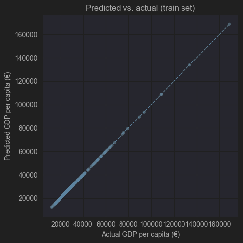

# SatStats
SatStats explores the relationship between European land classification data and GDP per capita, aiming to create classification based predictive models for GDP per capita and perform clustering, regression, and classification analysis.

## Dataset: 
The dataset consists of two files:

GDP Data: Obtained From EuroStat. Contains GDP per capita for NUTS3 regions. 

Land Classification Data: Obtained from CORINE datasets, a part of the EU Copernicus Project. Provides land usage statistics with 44 land types for the entirety of Europe, in raster format.

Using QGIS, a vector overlay of the NUTS3 regions was applied and Zonal Histogram generated and outputted to a CSV file. Using the NUTS3 region codes, the files were merged accordingly. Due to the varying sizes of the regions, all classification values were processed into their respective proportions of the region, and then standardized.

## Models:
The main approach to the problem involved implementing a variety of machine learning models tailored to the specific tasks of regression, classification, and clustering. The primary focus was on the classification models.

Classification models - Random Forest Classifier, Support Vector Classifier (SVC), and Logistic Regression

Regression models - Random Forest Regressor, LSTM

Clustering models - K-Means and Hierarchical Clustering

## Results:

LSTM:

Classification - Random Forest achieved accuracy of 0.767 for data classified into low, medium, and high bins, while the other models were far less effective.

Regression - Random Forest achieved R² of 0.55 and Mean Absolute Error (MAE) of 7223.20.

KMeans Clustering:

